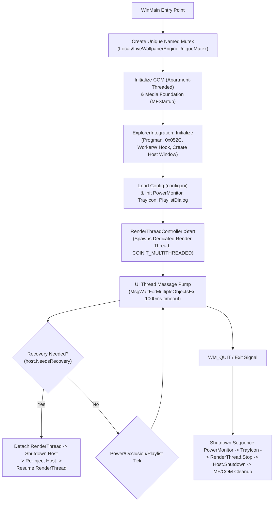

# LiveWallpaper Codebase Audit: Agent 2 (Shell, Concurrency, State Machine & Lifecycle)

**Auditor Profile:** Windows Systems & OS Internals Engineer  
**Scope of Responsibility:** Windows Shell Integration (`explorer.exe` / `WorkerW` injection), Multi-Threaded Concurrency, State Machine, UI Message Pumps, Power & Activity Monitoring, Playlist Management, Utility Safety, and Lifecycle Robustness.

---

# Phase 1: Executive Audit Plan

### 1. Architectural Flow Model



1. **Entry Point & Mutual Exclusion**: `WinMain` (`src/main.cpp:43-73`) creates a named session-local mutex (`Local\LiveWallpaperEngineUniqueMutex`) with an explicit SDDL descriptor granting access to `SY`, `BA`, current user SID, and Low Integrity SACL (`ML;;NW;;;LW`). If `ERROR_ALREADY_EXISTS`, it terminates immediately.
2. **Subsystem Initialization**:
   - COM is initialized on the UI thread with `COINIT_APARTMENTTHREADED` (`src/main.cpp:145`).
   - Media Foundation is initialized via `MFStartup(MF_VERSION)` (`src/main.cpp:180`).
   - `ExplorerIntegration` (`src/explorer_integration.cpp:10`) initializes the desktop attachment: it locates `Progman`, dispatches undocumented message `0x052C`, locates the WorkerW hierarchy, creates a `WS_CHILD` host window (`LiveWallpaperHostClass`), and parents it behind `SHELLDLL_DefView`.
   - `Config` (`src/config.cpp:13`) loads configuration parameters from `%APPDATA%\LiveWallpaper\config.ini`.
   - `RenderThreadController` (`src/render_thread_controller.cpp:16`) spawns a dedicated rendering thread running `ThreadProc` with multi-threaded COM (`COINIT_MULTITHREADED`), initializing Direct3D 11, swapchain, and media decoding.
   - `PowerMonitor` (`src/power_monitor.cpp:39`) and `TrayIcon` (`src/tray_icon.cpp:33`) register Win32 message windows and hook into power notifications, taskbar status, and foreground window changes.
3. **Pumping & Watchdog Dispatch Loop**:
   - The UI thread runs a message pump using `MsgWaitForMultipleObjectsEx(0, NULL, 1000, QS_ALLINPUT, MWMO_INPUTAVAILABLE)` (`src/main.cpp:426`).
   - Every loop iteration or message wakeup, the UI thread checks `host.NeedsRecovery()` (`src/explorer_integration.cpp:212`), checks power/occlusion states via `PowerMonitor::CheckForegroundAndIdleStates()` (`src/power_monitor.cpp:190`), checks playlist rotation intervals, and polls host window rects.
4. **Shutdown Sequence**:
   - On `WM_QUIT`, the loop branches to `exit_loop` (`src/main.cpp:513`), shutting down `PowerMonitor`, `TrayIcon`, stopping the render thread via `m_syncManager->SetRunning(false)` and `m_renderThread.join()`, destroying the host window, and shutting down MF and COM.

---

### 2. Explicit Assumptions & Win32 Shell Contracts

- **Progman / WorkerW Desktop Hierarchy**:
  - Dispatching message `0x052C` to `Progman` signals `explorer.exe` to spawn an unmapped `WorkerW` directly behind the window containing `SHELLDLL_DefView` (the desktop icon list view).
  - On Windows 10 (1809+) and Windows 11 (21H2–24H2), `SHELLDLL_DefView` is hosted inside an active top-level `WorkerW` (or `Progman`). The dedicated desktop wallpaper `WorkerW` is placed **immediately after** `parentOfShell` in the desktop Z-order.
  - Calling `FindWindowExW(NULL, NULL, L"WorkerW", NULL)` traverses from the very top of the desktop Z-order rather than starting search after `parentOfShell` (`FindWindowExW(NULL, parentOfShell, L"WorkerW", NULL)`). This violates the shell injection contract and risks binding to foreground WorkerW windows or third-party processes.
- **Child Window Coordinate Contracts**:
  - In Win32, `CreateWindowExW` and `SetWindowPos` for `WS_CHILD` windows interpret `(x, y)` as **parent client coordinates**, NOT screen coordinates.
  - Because the parent `WorkerW` is already a top-level window spanning the virtual desktop `(SM_XVIRTUALSCREEN, SM_YVIRTUALSCREEN)`, its client origin `(0, 0)` is at screen position `(SM_XVIRTUALSCREEN, SM_YVIRTUALSCREEN)`. Passing `SM_XVIRTUALSCREEN` to a child window creates a double-offset defect whenever virtual coordinates are negative.
- **System Broadcast Message Routing**:
  - Windows created with `HWND_MESSAGE` are message-only windows. By Win32 API definition, message-only windows **never receive broadcast messages** sent to `HWND_BROADCAST`, including `TaskbarCreated`, `WM_DISPLAYCHANGE`, and power setting notifications (`WM_POWERBROADCAST`).
  - Child windows (`WS_CHILD`) never receive `WM_DISPLAYCHANGE`.
- **Concurrency & UI Pumping Rules**:
  - Modeless dialogs require `IsDialogMessageW` in the main message pump for Tab, Enter, and Esc key routing.
  - Multi-threaded synchronization between UI and render loops must use atomic 64-bit packed values or Win32 waitable synchronization primitives (e.g. `HANDLE` events) rather than un-interruptible sleep loops.

---

### 3. Targeted Inspection Matrix

| Assigned File | Failure Mode Under Inspection | Verifiable Check (`[Scenario] -> verify: [check]`) |
| :--- | :--- | :--- |
| `src/render_thread_controller.cpp` | 100% CPU core busy-spin on detach/missing file | Request recreate with `nullptr` or set invalid video -> verify CPU core utilization does not spike to 100%. |
| `src/explorer_integration.cpp` | Negative virtual screen coordinate clipping | Secondary monitor placed to left of primary -> verify child window rect is `(0,0)` relative to parent and covers all monitors. |
| `src/power_monitor.cpp` | WorkerW self-occlusion false positive | Run on clean desktop -> verify `EnumWindowsOcclusionProc` does not classify `WorkerW` as an occluding window. |
| `src/explorer_integration.cpp` | Standalone fallback permanent lock | Kill `explorer.exe` -> verify `NeedsRecovery()` detects respawned Progman without sticking in standalone mode. |
| `src/power_monitor.cpp` | Desktop focus fullscreen false positive | Click desktop icons/background -> verify wallpaper does not pause. |
| `src/playlist_dialog.cpp` | Owner destruction zombie dialog | Trigger Explorer recovery while dialog open -> verify dialog is re-openable and class remains valid. |
| `src/tray_icon.cpp` | `TaskbarCreated` broadcast drop | Restart `explorer.exe` -> verify `TaskbarCreated` is received and tray icon is recreated. |
| `src/explorer_integration.cpp` | `WM_DISPLAYCHANGE` broadcast drop | Change display topology -> verify host window resizes to new extents. |
| `src/synchronization_manager.cpp` | Torn resize dimensions | Rapidly call `RequestResize` -> verify `CheckResize` loads atomic 64-bit packed pair. |
| `src/main.cpp` | Absence of DPI awareness | Open on 150% scaling display -> verify DWM does not apply bitmap stretch filter. |
| `src/utils.cpp` | Stack buffer overrun on long log lines | Log a message > 1024 chars -> verify `sprintf_s`/`swprintf_s` does not trigger CRT crash. |
| `src/config.cpp` / `tests/e2e_test_runner.py` | Delimiter mismatch in playlist parsing | Write comma-delimited playlist -> verify `Config::Load` successfully loads items. |
| `conversion_tool/convert.py` | Shader conversion with nested functions & commas | Convert shader with `atan(dot(a,b), c)` and trailing helper functions -> verify valid HLSL output. |

---

# Phase 2: Defect Catalog

## CRITICAL SEVERITY DEFECTS

---

### [BUG-CPU-01] 100% CPU Core Busy-Spin on Recovery Detach and Missing/Invalid Media Files
- **Target File & Lines**: `src/render_thread_controller.cpp:272-383`
- **Root Cause & Mechanism**:
  In `RenderThreadController::ThreadProc()`:
  When `targetHWnd == nullptr` (dispatched during Explorer recovery via `renderThread.RequestRecreate(nullptr)`), `InitializeMediaPipeline(nullptr, ...)` returns `false`.
  Consequently, `m_deviceManager->GetDevice()` is `nullptr` (`deviceValid == false`).
  Similarly, if `m_videoPath` points to a non-existent or corrupted file, `m_decoder->IsVideoLoaded()` is `false`.
  Tracing the execution path in the render loop:
  1. Line 279: `if (m_videoPath.empty() || isPaused)` evaluates to `false` (video path is set, not paused).
  2. Line 292: `if (isThrottled)` evaluates to `false` (desktop is visible).
  3. Line 314: `if (deviceValid)` evaluates to `false` (or line 334 `m_decoder->IsVideoLoaded()` is false). No frame rendering occurs; `frameUpdated` remains `false`.
  4. Line 366:
     ```cpp
     if (!deviceValid || FAILED(hrPresent)) {
         if (hrPresent == DXGI_ERROR_DEVICE_REMOVED || hrPresent == DXGI_ERROR_DEVICE_RESET) {
             LOG_WARN("RenderThreadController: Device loss detected. Triggering recovery...");
             m_syncManager->RequestRecreate(m_hWnd);
             Timer::PreciseSleep(500.0);
         }
     }
     ```
     Because `hrPresent` was initialized to `S_OK` at line 299, the inner `if` condition evaluates to `false`. The 500ms sleep is bypassed!
  5. Line 376: `if (fps > 0 && frameUpdated)` evaluates to `false` because `frameUpdated` is `false`. The frame rate limiter sleep is bypassed!
  6. The loop iterates immediately with zero sleep.
  The render thread enters an **unthrottled 100% CPU core spin-lock** executing millions of empty iterations per second.
- **Failure Scenario**:
  Whenever Explorer recovery triggers a detach (`RequestRecreate(nullptr)`), or whenever a configured video is deleted or moved, a CPU core spikes to 100% usage, draining battery and starving system threads.
- **Surgical Remediation**:
  In `src/render_thread_controller.cpp`, add an explicit fallback sleep if no device exists, no frame was rendered, or rendering is idle/detached:
  ```cpp
  // Step 8: Frame rate limiting & fallback idle sleep
  int fps = m_syncManager->GetFPSLimit();
  if (fps > 0 && frameUpdated) {
      double targetFrameTimeMs = 1000.0 / fps;
      double elapsedMs = frameRateTimer.GetElapsedMilliseconds();
      if (elapsedMs < targetFrameTimeMs) {
          Timer::PreciseSleep(targetFrameTimeMs - elapsedMs);
      }
  } else if (!frameUpdated) {
      // Fallback sleep to prevent 100% CPU core spin when detached, missing media, or idle
      Timer::PreciseSleep(30.0);
  }
  ```

---

### [BUG-SH-05] Negative Coordinate Clipping in Multi-Monitor WS_CHILD Desktop Attachment
- **Target File & Lines**: `src/explorer_integration.cpp:156-172, 193-206, 258-271`
- **Root Cause & Mechanism**:
  In `CreateHostWindow()` (`src/explorer_integration.cpp:156-172`):
  ```cpp
  int x = GetSystemMetrics(SM_XVIRTUALSCREEN);
  int y = GetSystemMetrics(SM_YVIRTUALSCREEN);
  int cx = GetSystemMetrics(SM_CXVIRTUALSCREEN);
  int cy = GetSystemMetrics(SM_CYVIRTUALSCREEN);
  ...
  DWORD style = WS_POPUP | WS_VISIBLE;
  if (m_hWorkerW) {
      style = WS_CHILD | WS_VISIBLE;
  }
  m_hWnd = CreateWindowExW(
      WS_EX_NOACTIVATE, L"LiveWallpaperHostClass", L"LiveWallpaperHost",
      style, x, y, cx, cy, m_hWorkerW, NULL, hInstance, this
  );
  ```
  And in `InjectIntoDesktop()` (`src/explorer_integration.cpp:204`) and `WndProc(WM_DISPLAYCHANGE)` (`src/explorer_integration.cpp:269`):
  ```cpp
  SetWindowPos(m_hWnd, hWndInsertAfter, x, y, cx, cy, SWP_NOACTIVATE | SWP_SHOWWINDOW);
  ```
  Per the Win32 API specification for `CreateWindowExW` and `SetWindowPos`:
  For a `WS_CHILD` window, the `(x, y)` parameters specify coordinates **relative to the upper-left corner of the parent window's client area**.
  The parent window (`m_hWorkerW`) is already a top-level window positioned at `(SM_XVIRTUALSCREEN, SM_YVIRTUALSCREEN)`. Its client origin `(0, 0)` is at screen position `(SM_XVIRTUALSCREEN, SM_YVIRTUALSCREEN)`.
  In any multi-monitor setup where a monitor is positioned to the left of the primary monitor, `SM_XVIRTUALSCREEN` is **negative** (e.g. `-1920`).
  Passing `x = -1920` to `SetWindowPos` places the child window at `-1920` relative to the parent's client area, which translates to screen coordinate **`-3840`**!
- **Failure Scenario**:
  Any user with a secondary monitor arranged to the left or above the primary monitor sees the wallpaper completely offset into the negative void. The left monitor shows black desktop icons without wallpaper, while the primary monitor displays only the right half of the wallpaper.
- **Surgical Remediation**:
  When parented to `m_hWorkerW` (`WS_CHILD`), `x` and `y` must be strictly `0, 0`, and the dimensions must match `WorkerW`'s client rect:
  ```cpp
  int x = 0, y = 0, cx = 0, cy = 0;
  if (m_hWorkerW) {
      RECT rcParent;
      GetClientRect(m_hWorkerW, &rcParent);
      x = 0;
      y = 0;
      cx = rcParent.right - rcParent.left;
      cy = rcParent.bottom - rcParent.top;
  } else {
      x = GetSystemMetrics(SM_XVIRTUALSCREEN);
      y = GetSystemMetrics(SM_YVIRTUALSCREEN);
      cx = GetSystemMetrics(SM_CXVIRTUALSCREEN);
      cy = GetSystemMetrics(SM_CYVIRTUALSCREEN);
  }
  ```

---

### [BUG-PWR-03] WorkerW Self-Occlusion Causes Permanent 1 FPS Throttle and Runaway Disk Thrashing
- **Target File & Lines**: `src/power_monitor.cpp:133-172, 174-188, 274-282`
- **Root Cause & Mechanism**:
  Inside `EnumWindowsOcclusionProc` (`src/power_monitor.cpp:133-172`):
  ```cpp
  wchar_t className[256];
  if (GetClassNameW(hWnd, className, 256) > 0) {
      if (wcscmp(className, L"TaskbarEngineHoverOverlay") == 0 ||
          wcscmp(className, L"Progman") == 0 ||
          wcscmp(className, L"Shell_TrayWnd") == 0) {
          return TRUE;
      }
  }
  ...
  if (GetWindowRect(hWnd, &rcWin)) {
      if (rcWin.left <= pData->rcMonitor.left && rcWin.top <= pData->rcMonitor.top &&
          rcWin.right >= pData->rcMonitor.right && rcWin.bottom >= pData->rcMonitor.bottom) {
          pData->isFullyCovered = true;
          LOG_INFO("EnumWindowsOcclusionProc: Fully covered by HWND: %p, Class: %ls...", hWnd, className);
          return FALSE;
      }
  }
  ```
  `EnumWindows` enumerates all top-level windows in Z-order.
  `WorkerW` (the Windows desktop shell window) is a top-level window with `WS_VISIBLE`.
  Its dimensions cover the entire monitor (`rcWin == pData->rcMonitor`).
  Because `WorkerW`, `SHELLDLL_DefView`, and `LiveWallpaperHostClass` are **NOT** excluded in line 139, `EnumWindowsOcclusionProc` encounters `WorkerW` on **every invocation**.
  It sets `pData->isFullyCovered = true` and returns `FALSE`.
  `CheckDesktopOcclusion()` (`src/power_monitor.cpp:174`) returns `true` **100% of the time**, even when no application windows are open!
  This causes two compounding failures:
  1. `EvaluatePowerState()` (`src/power_monitor.cpp:123`) sets `renderThread.SetThrottled(true)`. The wallpaper is permanently throttled to **1 FPS** on normal desktops!
  2. Line 156 writes `LOG_INFO("EnumWindowsOcclusionProc: Fully covered...")` directly to `log.txt` on every single second, writing 3,600 disk entries per hour and bloating the log file indefinitely.
- **Failure Scenario**:
  The application is incapable of running at standard frame rates (30/60 FPS) on a normal desktop, remaining locked at 1 FPS with continuous disk I/O.
- **Surgical Remediation**:
  Add `WorkerW`, `SHELLDLL_DefView`, `Shell_SecondaryTrayWnd`, and `LiveWallpaperHostClass` to the exclusion list in `EnumWindowsOcclusionProc`, and eliminate logging from the per-second enumeration callback:
  ```cpp
  if (wcscmp(className, L"TaskbarEngineHoverOverlay") == 0 ||
      wcscmp(className, L"Progman") == 0 ||
      wcscmp(className, L"WorkerW") == 0 ||
      wcscmp(className, L"SHELLDLL_DefView") == 0 ||
      wcscmp(className, L"Shell_TrayWnd") == 0 ||
      wcscmp(className, L"Shell_SecondaryTrayWnd") == 0 ||
      wcscmp(className, L"LiveWallpaperHostClass") == 0) {
      return TRUE;
  }
  ```

---

### [BUG-SH-01] Standalone Fallback Permanently Breaks Explorer Restart Recovery
- **Target File & Lines**: `src/explorer_integration.cpp:52-60, 216-228`
- **Root Cause & Mechanism**:
  In `FindWorkerW()` (`src/explorer_integration.cpp:52-60`):
  ```cpp
  HWND progman = FindWindowW(L"Progman", NULL);
  if (!progman) {
      LOG_WARN("Progman window not found. Falling back to Standalone / Test Window mode.");
      m_hWorkerW = nullptr;
      m_hShellDefView = nullptr;
      m_useLegacyWorkerW = false;
      return true;
  }
  ```
  When `progman` is NULL (during Explorer restart or crash recovery), `FindWorkerW()` sets `m_hWorkerW = nullptr` and returns **`true`**.
  `CreateHostWindow` then creates a top-level `WS_POPUP | WS_VISIBLE` window.
  In `NeedsRecovery()` (`src/explorer_integration.cpp:216-218`):
  ```cpp
  if (!m_hWorkerW) {
      return !IsWindow(m_hWnd);
  }
  ```
  Because `m_hWorkerW` is `nullptr` and `m_hWnd` is a valid window handle, `!IsWindow(m_hWnd)` is `false`.
  The function returns `false` on every iteration of the main message loop. The application never attempts to re-attach to the respawned `Progman`.
- **Failure Scenario**:
  If Explorer crashes or restarts, the wallpaper engine falls back to a borderless top-level popup covering the desktop and never docks behind desktop icons again until the process is restarted manually.
- **Surgical Remediation**:
  In `NeedsRecovery()` (`src/explorer_integration.cpp:212`):
  ```cpp
  bool ExplorerIntegration::NeedsRecovery() {
      if (m_isShuttingDown.load()) return false;
      HWND progman = FindWindowW(L"Progman", NULL);
      if (!m_hWorkerW) {
          // If in standalone fallback but Progman has appeared, trigger recovery
          return (progman != nullptr) || !IsWindow(m_hWnd);
      }
      if (!progman || !IsWindow(m_hWnd) || !IsWindow(m_hWorkerW)) {
          return true;
      }
      HWND parent = GetParent(m_hWnd);
      return (!parent || parent != m_hWorkerW);
  }
  ```

---

### [BUG-PWR-01] Desktop Focus Triggers False Positive Fullscreen Pause
- **Target File & Lines**: `src/power_monitor.cpp:219-245`
- **Root Cause & Mechanism**:
  In `CheckForegroundAndIdleStates()` (`src/power_monitor.cpp:221-242`):
  When the user clicks desktop icons or empty desktop space, Windows assigns foreground focus to `WorkerW` or `SHELLDLL_DefView`.
  The class exclusion check only filters `TaskbarEngineHoverOverlay`, `Progman`, and `Shell_TrayWnd`.
  Because `WorkerW` and `SHELLDLL_DefView` span the entire monitor, `newIsFullscreenAppRunning` is set to `true`, and `EvaluatePowerState()` (`src/power_monitor.cpp:112`) pauses rendering.
- **Failure Scenario**:
  Clicking anywhere on the Windows desktop freezes the live wallpaper immediately under the false assumption that a 3D game is running fullscreen.
- **Surgical Remediation**:
  Exclude desktop shell classes and the wallpaper host window class from fullscreen detection:
  ```cpp
  if (wcscmp(className, L"TaskbarEngineHoverOverlay") != 0 &&
      wcscmp(className, L"Progman") != 0 &&
      wcscmp(className, L"WorkerW") != 0 &&
      wcscmp(className, L"SHELLDLL_DefView") != 0 &&
      wcscmp(className, L"Shell_TrayWnd") != 0 &&
      wcscmp(className, L"Shell_SecondaryTrayWnd") != 0 &&
      wcscmp(className, L"LiveWallpaperHostClass") != 0)
  ```

---

### [BUG-UI-01] Dangling Parent HWND and Premature Class Unregistration Destroys Playlist Dialog
- **Target File & Lines**: `src/playlist_dialog.cpp:43-57, 121-129`, `src/main.cpp:397`
- **Root Cause & Mechanism**:
  In `main.cpp:397`:
  ```cpp
  trayIcon.SetManagePlaylistCallback([&]() {
      playlistDialog.Show(host.GetHWND(), playlist, currentPlaylistItem);
  });
  ```
  `host.GetHWND()` is passed as `parentWindow` to `CreateWindowExW`. In Win32, owned windows are automatically destroyed by the OS when their owner is destroyed.
  During Explorer recovery, `host.Shutdown()` calls `DestroyWindow(m_hWnd)`, destroying `playlistDialog.m_hWnd`.
  In `PlaylistDialog::WndProc`:
  ```cpp
  case WM_DESTROY:
      if (pThis->m_hFont) {
          DeleteObject(pThis->m_hFont);
          pThis->m_hFont = nullptr;
      }
      if (pThis->m_hInstance) {
          UnregisterClassW(L"LiveWallpaperPlaylistDialogClass", pThis->m_hInstance);
      }
      return 0;
  ```
  `pThis->m_hWnd = nullptr;` is never set, and `UnregisterClassW` unregisters the window class while the process is active.
  Subsequent clicks on "Manage Playlist..." fail because `m_hWnd` holds a dead handle, and `CreateWindowExW` fails with error `1407` (`ERROR_CANNOT_FIND_WND_CLASS`).
- **Failure Scenario**:
  After any desktop recovery cycle, the "Manage Playlist..." menu item stops working permanently.
- **Surgical Remediation**:
  1. Pass `NULL` as `parentWindow` in `main.cpp:397`.
  2. Set `pThis->m_hWnd = nullptr;` in `PlaylistDialog::WndProc(WM_DESTROY)`.
  3. Move `UnregisterClassW` from `WM_DESTROY` to `PlaylistDialog::~PlaylistDialog()`.

---

## HIGH SEVERITY DEFECTS

---

### [BUG-SH-02] Message-Only Window Drops `TaskbarCreated` Broadcast and Power Notifications
- **Target File & Lines**: `src/tray_icon.cpp:45-52, 331-337`, `src/power_monitor.cpp:49-68, 299-315`
- **Root Cause & Mechanism**:
  Both `TrayIcon::m_hWnd` and `PowerMonitor::m_hWnd` are created with `HWND_MESSAGE`:
  ```cpp
  m_hWnd = CreateWindowExW(0, ..., HWND_MESSAGE, NULL, hInstance, this);
  ```
  Microsoft Win32 documentation explicitly dictates:
  > *"A message-only window is not visible, has no z-order, cannot be handled, and **does not receive broadcast messages**."*
  When `explorer.exe` restarts, it broadcasts `TaskbarCreated` via `HWND_BROADCAST`. The OS filters this out for message-only windows, so `TrayIcon::WndProc` line 332 (`message == wmTaskbarCreated`) is never reached.
  Furthermore, `RegisterPowerSettingNotification` messages (`WM_POWERBROADCAST`) sent to `HWND_MESSAGE` are dropped on several Windows builds because notifications are dispatched through the top-level broadcast mechanism.
- **Failure Scenario**:
  On Explorer restart or graphics driver timeout recovery, the LiveWallpaper tray icon disappears permanently from the taskbar, leaving the user with no way to control the application. Power state transitions on battery/AC are dropped.
- **Surgical Remediation**:
  Create `m_hWnd` in both classes as an unowned, hidden top-level `WS_POPUP` window:
  ```cpp
  m_hWnd = CreateWindowExW(
      0, className, windowName, WS_POPUP,
      0, 0, 0, 0, NULL, NULL, hInstance, this
  );
  ```

---

### [BUG-SH-03] `WM_DISPLAYCHANGE` Missed Due to Child Window Architecture
- **Target File & Lines**: `src/explorer_integration.cpp:258-271`
- **Root Cause & Mechanism**:
  `ExplorerIntegration::m_hWnd` has style `WS_CHILD | WS_VISIBLE` parented to `m_hWorkerW`.
  Per Win32 specifications, Windows broadcasts `WM_DISPLAYCHANGE` exclusively to **top-level windows**. Child windows never receive `WM_DISPLAYCHANGE`.
  Because `PowerMonitor` and `TrayIcon` use `HWND_MESSAGE` (which also drop broadcasts), no window in the entire application receives `WM_DISPLAYCHANGE`.
  In `main.cpp:501`, `GetClientRect(currentHWnd, &rect)` is checked, but because `m_hWnd` never handled `WM_DISPLAYCHANGE` and never called `SetWindowPos`, `GetClientRect` returns stale dimensions.
- **Failure Scenario**:
  Connecting an external display, undocking a laptop, or changing screen resolution leaves the wallpaper rendering at the old resolution, causing black borders or cropped display.
- **Surgical Remediation**:
  Process `WM_DISPLAYCHANGE` inside the top-level hidden tray window, and trigger `SetWindowPos` on `host.GetHWND()` to update virtual screen boundaries.

---

### [BUG-SH-06] Inverted Z-Order Traversal in `FindWorkerW` Injects Behind Wrong Window or Over Icons
- **Target File & Lines**: `src/explorer_integration.cpp:110-120`
- **Root Cause & Mechanism**:
  In Pass 2 of `FindWorkerW()`:
  ```cpp
  HWND workerW = FindWindowExW(NULL, NULL, L"WorkerW", NULL);
  while (workerW) {
      if (workerW != parentOfShell && !FindWindowExW(workerW, NULL, L"SHELLDLL_DefView", NULL)) {
          wallpaperWorkerW = workerW;
          break;
      }
      workerW = FindWindowExW(NULL, workerW, L"WorkerW", NULL);
  }
  ```
  Passing `NULL` as `hwndChildAfter` begins traversal from the very top of the desktop Z-order.
  The Shell contract for `0x052C` creates the dedicated wallpaper `WorkerW` directly **behind** `parentOfShell` (the WorkerW containing `SHELLDLL_DefView`).
  If any other `WorkerW` exists in the system (e.g. from DWM animations, virtual desktop transitions, or external utilities) positioned higher in the Z-order than `parentOfShell`, `FindWorkerW` captures that window instead.
- **Failure Scenario**:
  LiveWallpaper injects into a WorkerW positioned in front of `SHELLDLL_DefView`, causing wallpaper frames to render on top of desktop icons and hiding files on the desktop.
- **Surgical Remediation**:
  Search for the WorkerW positioned immediately after `parentOfShell` in the Z-order:
  ```cpp
  HWND wallpaperWorkerW = FindWindowExW(NULL, parentOfShell, L"WorkerW", NULL);
  if (wallpaperWorkerW) {
      DWORD shellPid = 0, workerPid = 0;
      GetWindowThreadProcessId(progman, &shellPid);
      GetWindowThreadProcessId(wallpaperWorkerW, &workerPid);
      if (shellPid == workerPid) {
          m_hWorkerW = wallpaperWorkerW;
          m_useLegacyWorkerW = true;
      }
  }
  ```

---

### [BUG-SYNC-01] Non-Atomic Dimension Updates Cause Torn Resizing
- **Target File & Lines**: `src/synchronization_manager.h:58-60`, `src/synchronization_manager.cpp:41-60`
- **Root Cause & Mechanism**:
  In `RequestResize`:
  ```cpp
  m_newWidth.store(width, std::memory_order_release);
  m_newHeight.store(height, std::memory_order_release);
  m_resizeRequested.store(true, std::memory_order_release);
  ```
  And in `CheckResize`:
  ```cpp
  if (m_resizeRequested.compare_exchange_strong(expected, false, std::memory_order_acq_rel)) {
      outWidth = m_newWidth.load(std::memory_order_acquire);
      outHeight = m_newHeight.load(std::memory_order_acquire);
      return true;
  }
  ```
  `m_newWidth` and `m_newHeight` are two separate 32-bit atomics.
  If the UI thread is preempted between `m_newWidth.store` and `m_newHeight.store` while `m_resizeRequested` was already `true` from a previous resize, `CheckResize` loads the *new* width paired with the *old* height.
- **Failure Scenario**:
  Rapid monitor snapping or DPI changes cause the render thread to resize swapchains with mismatched aspect ratios (e.g. 2560x1080 instead of 2560x1440), distorting the image.
- **Surgical Remediation**:
  Pack width and height into a single 64-bit atomic integer:
  ```cpp
  std::atomic<uint64_t> m_newDimensions{ 0 };
  // Store:
  uint64_t packed = (static_cast<uint64_t>(width) << 32) | static_cast<uint32_t>(height);
  m_newDimensions.store(packed, std::memory_order_release);
  // Load:
  uint64_t packed = m_newDimensions.load(std::memory_order_acquire);
  outWidth = static_cast<int>(packed >> 32);
  outHeight = static_cast<int>(packed & 0xFFFFFFFF);
  ```

---

### [BUG-SYNC-02] Explorer Recovery Pipeline TOCTOU Race and Window Destruction
- **Target File & Lines**: `src/main.cpp:444-460`, `src/synchronization_manager.cpp:62-74`, `src/render_thread_controller.cpp:179-195`
- **Root Cause & Mechanism**:
  In `main.cpp:444-460`:
  `renderThread.RequestRecreate(nullptr)` is called.
  The UI thread polls `while (!renderThread.IsDetached() && ... < 1000)` with `Timer::PreciseSleep(10.0)`.
  If the render thread is sleeping (e.g. throttled), `IsDetached()` may not be set before the 1000ms timeout expires.
  Upon timeout, `main.cpp` logs a warning and proceeds directly to `host.Shutdown()`, which calls `DestroyWindow(m_hWnd)`.
  This destroys the HWND on the UI thread while the render thread is concurrently executing DirectX 11 swapchain calls (`Present()`, `ResizeBuffers()`) on that same HWND.
- **Failure Scenario**:
  Explorer restarts lead to sporadic crashes with `DXGI_ERROR_INVALID_CALL` or access violations in `dxgi.dll` due to window destruction under active rendering.
- **Surgical Remediation**:
  Use a waitable Win32 event (`m_hDetachedEvent`) for the detach handshake. The UI thread waits on the event; the render thread signals it immediately after `TeardownMediaPipeline()` finishes before any window destruction occurs.

---

### [BUG-PWR-02] Focus Assist and UWP Apps Trigger Bogus Obscured State
- **Target File & Lines**: `src/power_monitor.cpp:250-266`
- **Root Cause & Mechanism**:
  In `PowerMonitor::CheckForegroundAndIdleStates` (`src/power_monitor.cpp:250-266`):
  ```cpp
  if (notificationState == QUNS_NOT_PRESENT ||
      notificationState == QUNS_BUSY ||
      notificationState == QUNS_RUNNING_D3D_FULL_SCREEN ||
      notificationState == QUNS_PRESENTATION_MODE ||
      notificationState == QUNS_APP ||
      notificationState == QUNS_RUNNING_PLAY_TO) {
      newIsObscured = true;
  ```
  `QUNS_BUSY` (value 2) is returned when Windows "Focus Assist" (Do Not Disturb) is enabled, even if the user is sitting idly on the desktop with zero applications open.
  `QUNS_APP` (value 7) is returned whenever any modern UWP or Store app (Calculator, Settings, Windows Terminal) is running windowed.
  Setting `newIsObscured = true` causes `EvaluatePowerState()` to pause rendering entirely.
- **Failure Scenario**:
  Any user who has Windows Focus Assist enabled (default behavior during scheduled night hours or full-screen gaming profiles) has their live wallpaper permanently frozen on the desktop.
- **Surgical Remediation**:
  Restrict `newIsObscured` strictly to true full-screen exclusive DirectX games and non-interactive sessions:
  ```cpp
  if (notificationState == QUNS_NOT_PRESENT ||
      notificationState == QUNS_RUNNING_D3D_FULL_SCREEN ||
      notificationState == QUNS_PRESENTATION_MODE) {
      newIsObscured = true;
  }
  ```

---

### [BUG-UTIL-01] Stack Buffer Overrun Crash on Long Log Messages in `Utils::Log` / `Utils::LogW`
- **Target File & Lines**: `src/utils.cpp:115-116, 167-169`
- **Root Cause & Mechanism**:
  In `Utils::Log` and `Utils::LogW`:
  ```cpp
  int len = _vscprintf(format, args) + 1;
  std::vector<char> buf(len);
  vsnprintf(buf.data(), len, format, args);
  va_end(args);

  // Output to debug console
  char debugMsg[1024];
  sprintf_s(debugMsg, "[%s] [%s] %s\n", timeStr, GetLevelString(level), buf.data());
  OutputDebugStringA(debugMsg);
  ```
  While `buf` is dynamically sized to handle arbitrarily long format strings, `debugMsg` is a fixed stack buffer of only **1024 bytes**.
  `sprintf_s` enforces bounds checking. If `buf.data()` plus timestamp and level exceeds 1023 bytes (common when logging shader compilation errors, full paths, or environment dumps), MSVC's `sprintf_s` invokes the CRT Invalid Parameter Handler, which immediately crashes the process (`STATUS_INVALID_PARAMETER`).
- **Failure Scenario**:
  A shader compilation error containing compiler diagnostic text or an extensive file path is logged, resulting in an instant crash of `LiveWallpaper.exe`.
- **Surgical Remediation**:
  Pass `buf.data()` directly to `OutputDebugString` or size `debugMsg` dynamically:
  ```cpp
  std::string debugMsg = "[" + std::string(timeStr) + "] [" + GetLevelString(level) + "] " + buf.data() + "\n";
  OutputDebugStringA(debugMsg.c_str());
  ```

---

### [BUG-CFG-01] Playlist Delimiter Mismatch between Config Parser and Test Runner
- **Target File & Lines**: `src/config.cpp:35-46, 76`, `tests/e2e_test_runner.py:103`
- **Root Cause & Mechanism**:
  `Config::Load` (`src/config.cpp:35`) parses `Playlist` using the pipe character `|`:
  ```cpp
  size_t end = playlistStr.find(L'|');
  ```
  However, `tests/e2e_test_runner.py:103` serializes playlists joined by commas:
  ```python
  playlist_str = ",".join(playlist)
  ```
  When tests run (`test_f_t4_3_playlist_video_rotation`), `Config::Load` sees no pipe `|`, treats `path1,path2` as a single path, fails path validation on the combined string, logs `[WARN] Config loaded invalid or unsafe playlist item... Skipping`, and yields an empty playlist.
- **Failure Scenario**:
  All multi-item playlist operations configured via standard CSV format fail silently to load.
- **Surgical Remediation**:
  In `src/config.cpp`, accept both `,` and `|` as delimiters when splitting playlist strings:
  ```cpp
  size_t end = playlistStr.find_first_of(L"|,");
  ```

---

## MEDIUM SEVERITY DEFECTS

---

### [BUG-DPI-01] Absence of DPI Awareness Configuration Causes DWM Virtualization Blurring
- **Target File & Lines**: `src/main.cpp:43-150`
- **Root Cause & Mechanism**:
  The application does not set DPI awareness via `SetProcessDpiAwarenessContext`, `SetProcessDPIAware`, or an application manifest.
  By default on Windows 10/11, an unmanifested process runs as `DPI_UNAWARE`.
  When `m_hWnd` (DPI Unaware) is injected as a child into `WorkerW` (which is Per-Monitor DPI Aware V2 hosted by `explorer.exe`), Windows activates DWM DPI bitmap stretching on the child window.
  On any display running at >100% DPI scaling (e.g. 125%, 150%, 200%), the wallpaper render target is scaled down by DWM and then bitmap-interpolated back up, introducing significant blur and aspect distortion.
- **Failure Scenario**:
  High-DPI displays (such as 4K monitors and modern laptops) render live wallpapers with severe blurring and incorrect coordinate mappings.
- **Surgical Remediation**:
  At the beginning of `WinMain` in `src/main.cpp`:
  ```cpp
  SetProcessDpiAwarenessContext(DPI_AWARENESS_CONTEXT_PER_MONITOR_AWARE_V2);
  ```

---

### [BUG-PWR-04] Single-Monitor Occlusion Blind Spot in Multi-Monitor Setups
- **Target File & Lines**: `src/power_monitor.cpp:174-188`
- **Root Cause & Mechanism**:
  In `PowerMonitor::CheckDesktopOcclusion`:
  ```cpp
  HMONITOR hPrimary = MonitorFromWindow(GetDesktopWindow(), MONITOR_DEFAULTTOPRIMARY);
  ```
  The occlusion check only monitors the primary monitor (`hPrimary`).
  In a multi-monitor environment:
  1. If an application is maximized on monitor 2, `CheckDesktopOcclusion` ignores it.
  2. If an application is maximized on monitor 1, `CheckDesktopOcclusion` throttles the wallpaper for ALL monitors, even if monitor 2 has an unobstructed desktop.
- **Failure Scenario**:
  Occlusion throttling does not respect per-monitor desktop visibility.
- **Surgical Remediation**:
  Enumerate all active display monitors via `EnumDisplayMonitors` and verify whether *all* monitors are occluded before throttling global rendering.

---

### [BUG-SH-04] Indiscriminate WorkerW Discovery Across Processes
- **Target File & Lines**: `src/explorer_integration.cpp:86-96, 110-119`
- **Root Cause & Mechanism**:
  `FindWorkerW` enumerates top-level windows of class `WorkerW` using `FindWindowExW` without validating that the window belongs to `explorer.exe` via `GetWindowThreadProcessId`.
  If an external software utility creates a `WorkerW` window, LiveWallpaper may inject itself as a child of an unrelated foreign process.
- **Failure Scenario**:
  Running alongside virtual desktop tools or third-party shell replacements causes wallpaper injection to target the wrong application window.
- **Surgical Remediation**:
  Obtain Explorer's PID from `Progman` and verify that the target WorkerW matches:
  ```cpp
  DWORD explorerPid = 0;
  GetWindowThreadProcessId(progman, &explorerPid);
  DWORD workerPid = 0;
  GetWindowThreadProcessId(workerW, &workerPid);
  if (workerPid == explorerPid) { ... }
  ```

---

### [BUG-SYNC-03] UI Freeze on Exit Due to Uninterruptible Throttled Sleep
- **Target File & Lines**: `src/render_thread_controller.cpp:32-42, 292-295`
- **Root Cause & Mechanism**:
  When occluded, line 294 calls `Timer::PreciseSleep(1000.0)`.
  In `Stop()`, `m_syncManager->SetRunning(false)` is set, followed immediately by `m_renderThread.join()`.
  Because `Timer::PreciseSleep` has no cancellation token or wakeable wait handle, the calling UI thread blocks in `join()` for up to 1000ms until the sleep expires.
- **Failure Scenario**:
  Exiting LiveWallpaper while desktop is occluded induces a noticeable 1-second UI stall.
- **Surgical Remediation**:
  Use a Win32 manual-reset event `m_hStopEvent` and replace sleep with `WaitForSingleObject(m_hStopEvent, 1000)`. `Stop()` sets `m_hStopEvent` to unblock immediately.

---

### [BUG-ARCH-01] Desynchronized Duplicate `PlaylistManager` in `RenderThreadController`
- **Target File & Lines**: `src/render_thread_controller.h:51`, `src/render_thread_controller.cpp:24, 75-84, 231-261`, `src/main.cpp:276-287, 477-488`
- **Root Cause & Mechanism**:
  Architectural split-brain: `main.cpp` maintains its own `std::vector<std::wstring> playlist` and handles playlist rotation directly in the UI message loop (`src/main.cpp:477-488`). It never calls `renderThread.SetPlaylist(...)` or `renderThread.SetRotationInterval(...)`.
  Meanwhile, `RenderThreadController` allocates and updates an internal `PlaylistManager` (`m_playlistManager`) which only ever holds the single initial video.
- **Failure Scenario**:
  Redundant CPU cycles locking a mutex every frame in `PlaylistManager::Update` on the render thread; potential for duplicate video transitions if APIs are ever called.
- **Surgical Remediation**:
  Remove the internal `PlaylistManager` from `RenderThreadController` and centralize all playlist management in `main.cpp`.

---

### [BUG-UI-02] Missing `IsDialogMessageW` Breaks Keyboard Navigation in Playlist Dialog
- **Target File & Lines**: `src/main.cpp:428-434`
- **Root Cause & Mechanism**:
  The Win32 message loop in `main.cpp` directly passes messages to `TranslateMessage` and `DispatchMessageW`.
  Modeless dialogs containing controls require `IsDialogMessageW` to manage Tab ordering, mnemonic accelerators, Enter, and Esc.
- **Failure Scenario**:
  In "Manage Playlist", users cannot Tab between controls, press Enter to Save, or press Esc to Cancel.
- **Surgical Remediation**:
  In `src/main.cpp:428-434`:
  ```cpp
  if (playlistDialog.GetHWND() && IsWindow(playlistDialog.GetHWND()) && IsDialogMessageW(playlistDialog.GetHWND(), &msg)) {
      continue;
  }
  ```

---

### [BUG-TOOL-01] Shader Converter RegEx Truncation and Misplaced Return Statement
- **Target File & Lines**: `conversion_tool/convert.py:70, 110-112`, `gui_convert.py:59, 90-92`
- **Root Cause & Mechanism**:
  1. `r'\batan\s*\(\s*([^,]+)\s*,\s*([^)]+)\s*\)'` fails when arguments contain commas (e.g. `atan(dot(p, q), r)`). `([^,]+)` stops at the first comma inside `dot(p, q)`, splitting `dot(p` and `q)` into `atan2(dot(p, q), r);`, leaving `, r);` as a syntax error.
  2. `code.rfind('}')` blindly appends `return fragColor;` to the very last closing brace in the file. If any helper functions follow `mainImage`, the return statement is inserted into the helper function, leaving `main` without a return statement.
- **Failure Scenario**:
  Converting ShaderToy GLSL shaders with helper functions placed below `mainImage` produces invalid HLSL that fails D3D compilation.
- **Surgical Remediation**:
  Track brace nesting depth from the `main` signature to identify the exact closing brace of `mainImage`, and use paren-matching logic for 2-argument `atan` conversion.

---

## LOW SEVERITY DEFECTS

---

### [BUG-LOG-01] Missing Runtime Log File Rotation Causes Unbounded Disk Growth
- **Target File & Lines**: `src/utils.cpp:44-59`
- **Root Cause & Mechanism**:
  Log file size checking and rotation to `log.bak` only occurs once during `Utils::InitializeLogging()` at application startup.
  During execution, lines are appended via `fprintf(file, ...)` without checking file size.
  When background logging occurs (such as during occlusion checks or error loops), `log.txt` grows indefinitely until the process is terminated.
- **Failure Scenario**:
  Running LiveWallpaper for weeks without restarting results in multi-gigabyte `log.txt` files on disk.
- **Surgical Remediation**:
  Perform file size verification periodically (e.g. every 1,000 log writes) inside `Utils::Log` and rotate dynamically.

---

### [BUG-BLD-01] `/arch:AVX2` Compiler Option Breaks CPU Compatibility on Older Hardware
- **Target File & Lines**: `CMakeLists.txt:103`
- **Root Cause & Mechanism**:
  `$<$<CONFIG:Release>:/arch:AVX2>` unconditionally enables AVX2 instructions. On CPUs without AVX2 (pre-Haswell 2013, budget Celeron/Pentium, or older VMs), the executable terminates immediately with `STATUS_ILLEGAL_INSTRUCTION`.
- **Failure Scenario**:
  Running on older or virtualized systems crashes on process start.
- **Surgical Remediation**:
  Remove `/arch:AVX2` or replace with `/arch:SSE2` (default on x64) to maximize end-user compatibility.

---

### [BUG-CMD-01] Naive Whitespace Splitting in CLI Parser Corrupts Quoted Paths
- **Target File & Lines**: `src/main.cpp:88-114`
- **Root Cause & Mechanism**:
  `main.cpp` parses `lpCmdLine` using naive `isspace` tokenization without honoring quotes. Paths containing spaces or forward slashes (e.g. `/path/to/video.mp4`) are misidentified as unknown CLI flags, causing immediate process termination.
- **Failure Scenario**:
  Passing wallpaper paths containing spaces or forward slashes via command-line triggers an invalid argument exit.
- **Surgical Remediation**:
  Use `CommandLineToArgvW(GetCommandLineW(), &argc)` for all command-line validation and tokenization.

---

# Phase 3: Cross-Subsystem Notes for Agent 1 (Graphics / Media)

1. **Resolution Change & Swapchain Extents**:
   Once `WM_DISPLAYCHANGE` is routed through the top-level tray window (`BUG-SH-03`), `host.GetHWND()` will resize dynamically. Agent 1 should ensure `SwapChainManager::Resize` safely handles zero-extent guards (`width == 0 || height == 0`) and releases all Direct3D 11 render target view references before invoking `IDXGISwapChain::ResizeBuffers`.
2. **Device Loss Recovery & MF Pipeline Flush**:
   When `DXGI_ERROR_DEVICE_REMOVED` or `DXGI_ERROR_DEVICE_RESET` occurs (`src/render_thread_controller.cpp:367`), `TeardownMediaPipeline()` releases the D3D11 device and `IMFDXGIDeviceManager`. In-flight sample requests inside `m_decoder->UpdateFrame` must be flushed to prevent accessing a released D3D11 context.
3. **Occlusion Throttling Frame Presentation**:
   When `isThrottled` is active, the render thread sleeps. Once the WorkerW self-occlusion bug (`BUG-PWR-03`) is fixed, throttling will only occur when windows truly cover the screen. Smooth VSync transitions back to full framerate must ensure the present queue is not starved.
